# LIRiAP

LIRiAP (Largest Inscribed Rectangle in Arbitary Polygon) is a set of QGIS Processing algorithms for computing the largest inscribed rectangles approximations for polygon features.

## Problem statement

Given an input polygon, find a large non axis aligned interior rectangle (concave polygons and polygons with holes supported). In this pack, **three different problem variants** are implemented:

1. **Approximation family**: maximize area quickly, without strict containment certification. Good for finding candidates
2. **Contained family**: enforce containment certification, but do not run boundary expansion after certification.
3. **BCRS family**: containment certification **plus** boundary-coordinate expansion (CABF) - contain & extend. This is the only family in this pack intended to mostly solve the full "largest-area, non axis aligned, fully contained rectangle with expansion" target. Best for finding results closer to solves on more limited set of features.

## Result screenshots (constrained to 16:10 resolution)

### Approximation (less vs denser grid)

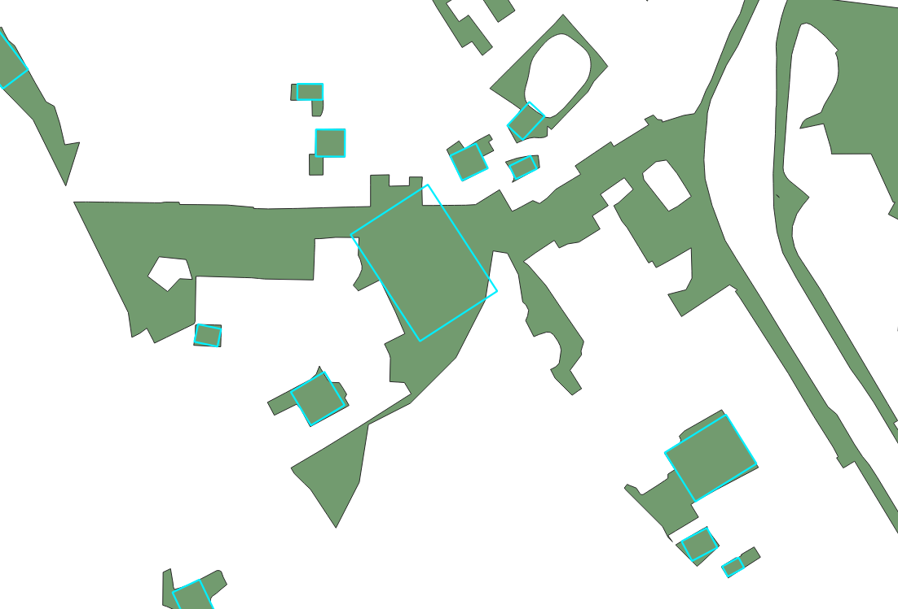

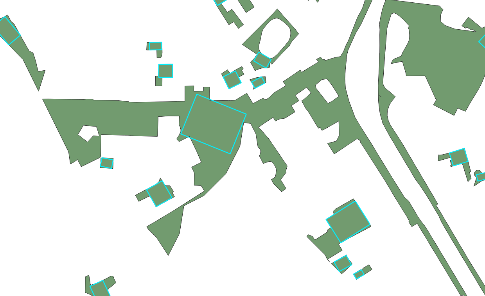

### Contained

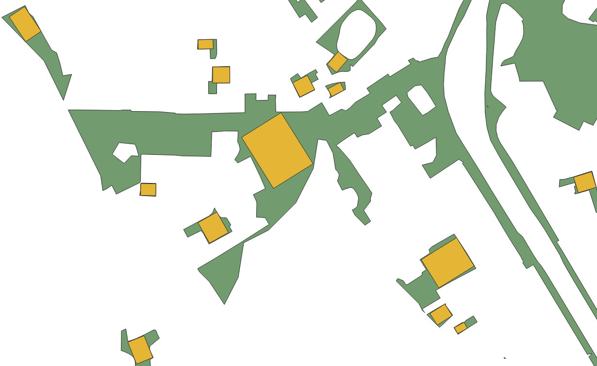

### BCRS (Boundary-Coordinate Raster Solve)

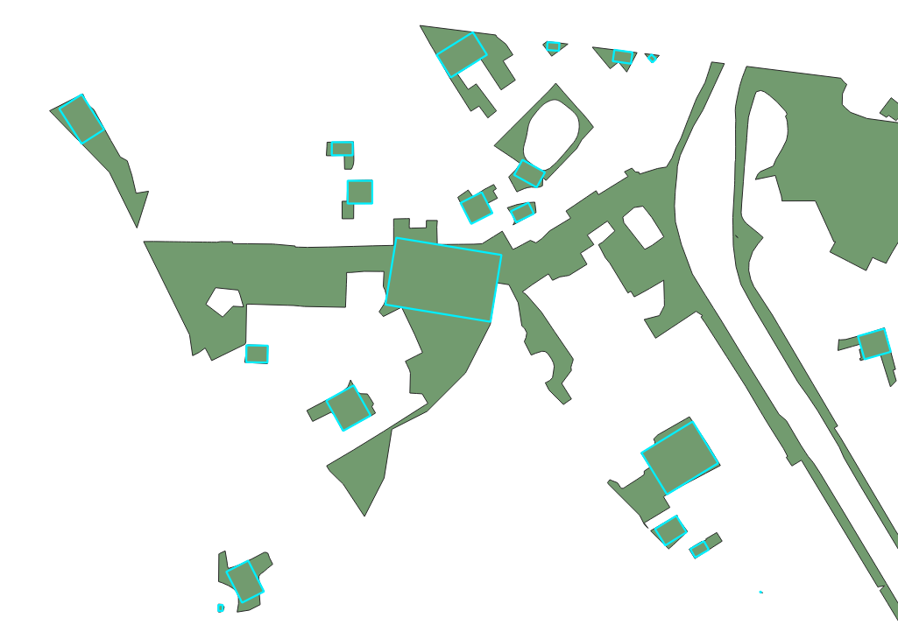

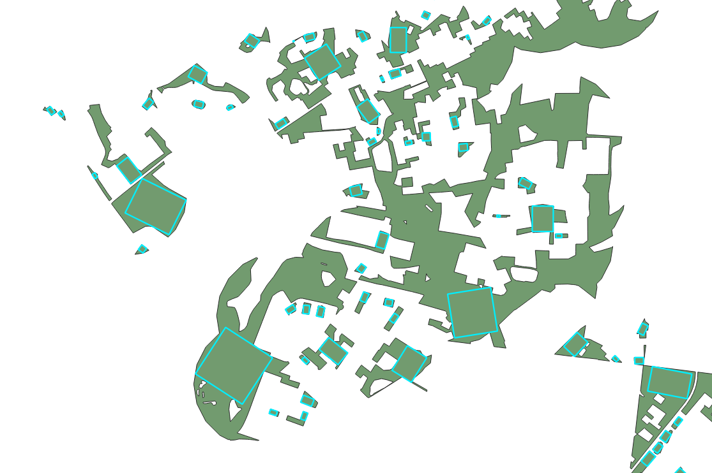

---

## Potential uses

- **Suitability analysis**: search candidate locations for building or infrastructure placement by finding the largest feasible rectangular footprint inside constrained parcels (e.g., houses, warehouses, solar arrays, staging pads, retention structures) while respecting parcel boundaries and holes/exclusions.
- **Remote sensing**: derive stable interior rectangular patches for spectral sampling, calibration windows, texture statistics, and object-level summaries where centroid or full-polygon sampling is noisy.
- **Dynamic cartographic label placement**: place labels in the largest interior rectangle instead of using only centroid or bounding box, improving readability in concave polygons and polygons with holes. An axis-aligned version could be fast enough to handle this task.
- **Other scenarios**: map tiling anchors, drone landing-zone preselection, interior ROI extraction for QA workflows, and standardized shape descriptors for downstream analytics.

The less the features the denser the grid can be whilst still maintaining reasonable accuracy.

### Potential for other algorithms

The ideas in this pack could potentially be used to get solutions for other contained shapes, as well as the reverse problem - finding positions for inscribed polygons in a rectangle in a way that maximizes used space.

## At a glance

From the fastest to slowest. BCRS without multhreaded processing is usually the best option for finding the maximum area. "Approximation fast" with multithreaded processing should be the best at finding candidates in large datasets. But this may vary depending on device and dataset. Mind that chunking blocks cancelling the run. I advise experimenting with grid parameters for the result best fitting your requirements (time of processing vs accuracy).

| Family        | Primary objective                            | Strict containment               | Boundary expansion |
| ------------- | -------------------------------------------- | -------------------------------- | ------------------ |
| Approximation | Fast area-focused search                     | No                               | No                 |
| Contained     | Certified contained rectangle search         | Yes (unless fallback is enabled) | No                 |
| BCRS          | Certified contained search + fit improvement | Yes (unless fallback is enabled) | Yes (CABF)         |

Best execution mode by algorithm (@290 @5406 are number of run features in a dataset):

| Algorithm                     | Best mode @290 | Best mode @5406 |
| ----------------------------- | -------------- | --------------- |
| Approximation Standard        | 12w            | 12w+chunk       |
| Approximation Fast            | 12w            | 12w+chunk       |
| Contained Standard (strict)   | 12w+chunk      | 12w             |
| Contained Standard (fallback) | 12w+chunk      | 12w+chunk       |
| Contained Fast (fallback)     | 12w+chunk      | 12w+chunk       |
| BCRS (strict)                 | 1w             | 1w              |
| BCRS (fallback)               | 1w             | 1w              |
| BCRS Fast (fallback)          | 1w             | 1w              |

## Shared components

All algorithms in `LIRiAP_pack` follow the same structure:

1. **Input normalization**: read polygon geometry; for multipolygons, use the largest part.
2. **Angle candidates**: extract likely orientations from polygon edge directions, with a fallback sweep.
3. **Rectangle solve in rotated frame**: solve axis-aligned rectangle candidates on a rotated polygon to recover non axis aligned solutions in map coordinates.
4. **Refinement and checks**: apply finer search and containment-related adjustments (depending on variant).
5. **Output**: write rectangle geometry and metrics (area, angle, ratio, and variant-specific diagnostics).

## Algorithms

| Algorithm                                               | What problem it solves                                       | Containment semantics                                                                                   | Expansion semantics                                                |
| ------------------------------------------------------- | ------------------------------------------------------------ | ------------------------------------------------------------------------------------------------------- | ------------------------------------------------------------------ |
| Approximation Standard                                  | Fast area-focused approximation                              | Not certified; rectangle can violate containment in difficult cases                                     | No expansion stage                                                 |
| Approximation Fast                                      | Same as Approximation Standard with lower overhead execution | Not certified; same semantics as Standard                                                               | No expansion stage                                                 |
| Contained Standard                                      | Certified contained rectangle search                         | Certified contained when strict mode succeeds; optional best-effort fallback can relax strict guarantee | No expansion stage after certification                             |
| Contained Fast                                          | Same as Contained Standard with optimized execution          | Same certified/best-effort semantics as Standard                                                        | No expansion stage after certification                             |
| BCRS (Boundary-Coordinate Raster Solve)                 | Full contained-plus-expansion solve                          | Certified contained when strict mode succeeds; optional best-effort fallback can relax strict guarantee | Includes CABF boundary expansion (full target method in this pack) |
| BCRS Fast (Boundary-Coordinate Raster Solve, optimized) | Same as BCRS with prioritized/optimized execution            | Same certified/best-effort semantics as BCRS                                                            | Includes CABF boundary expansion                                   |

## Setting semantics

- `ALWAYS_RETURN` (Contained/BCRS):
  - `False`: strict certification only; features may return no rectangle if strict containment cannot be certified.
  - `True`: returns best-effort fallback when strict certification fails (`best_effort=1`), so strict guarantee is no longer universal.
- `USE_BUFFER` + `BUFFER_VALUE` (Contained/BCRS): applies an additional containment margin in map units (usually reducing area to increase margin from boundaries/holes).
- `MAX_RATIO`: constrains the admissible rectangle aspect ratio; tighter cap can reduce max area.
- `GRID_*`, `ANGLE_STEP`, `TOP_K`: search density and candidate breadth controls; they change result quality/runtime tradeoff, not the solver family semantics.
- `N_WORKERS`, `USE_CHUNKING`, `AUTO_INSTALL_NUMBA`: runtime/performance controls only; they do not change geometric guarantees.

## Processing benchmark (default settings)

All runs assume default algorithm parameters and Numba installed. 290 and 5406 are the number of features in the testing dataset.

Benchmarked with:

- i5-12400F
- 32GB DDR4 RAM

### Baseline profile (N_WORKERS=1, USE_CHUNKING=False)

| Profile | Algorithm              | ALWAYS_RETURN            | Time @ 290 (s) *5 run average | Time @ 5406 (s) | Scale ratio (5406 / 290) |
| ------- | ---------------------- | ------------------------ | ----------------------------------- | --------------- | ------------------------ |
| P1      | Approximation Standard | n/a                      | 7.13*                               | 127.25          | 17.8471                  |
| P2      | Approximation Fast     | n/a                      | 6.98*                               | 125.93          | 18.0415                  |
| P3      | Contained Standard     | False (strict)           | 30.45                               | 574.13          | 18.8548                  |
| P4      | Contained Standard     | True (fallback enabled)  | 30.75                               | 573.59          | 18.6533                  |
| P5      | Contained Fast         | True (fallback enabled) | 12.25*                              | 226.05          | 18.4531                  |
| P6      | BCRS                   | False (strict)           | 42.91                               | 772.05          | 17.9923                  |
| P7      | BCRS                   | True (fallback enabled)  | 42.35                               | 788.03          | 18.6076                  |
| P8      | BCRS Fast              | True (fallback enabled)  | 23.61                               | 445.01          | 18.8484                  |

### Parallel profile (N_WORKERS=12, USE_CHUNKING=False)

| Profile | Algorithm              | ALWAYS_RETURN            | Time @ 290 (s) *5 run average | Time @ 5406 (s) | Scale ratio (5406 / 290) |
| ------- | ---------------------- | ------------------------ | ---------------------------------- | --------------- | ------------------------ |
| P1      | Approximation Standard | n/a                      | 5.97*                              | 112.30          | 18.8107                  |
| P2      | Approximation Fast     | n/a                      | 5.90*                              | 108.43          | 18.3780                  |
| P3      | Contained Standard     | False (strict)           | 22.27                              | 405.91          | 18.2268                  |
| P4      | Contained Standard     | True (fallback enabled)  | 22.05                              | 410.21          | 18.6036                  |
| P5      | Contained Fast         | True (fallback enabled) | 12.03*                             | 224.82          | 18.6883                  |
| P6      | BCRS                   | False (strict)           | 51.83                              | 925.01          | 17.8470                  |
| P7      | BCRS                   | True (fallback enabled)  | 50.88                              | 941.69          | 18.5081                  |
| P8      | BCRS Fast              | True (fallback enabled)  | 29.84                              | 557.11          | 18.6699                  |

### Parallel + chunking profile (N_WORKERS=12, USE_CHUNKING=True)

| Profile | Algorithm              | ALWAYS_RETURN            | Time @ 290 (s) *5 run average **too slow to be measure | Time @ 5406 (s) | Scale ratio (5406 / 290) |
| ------- | ---------------------- | ------------------------ | ---------------------------------------------------------------- | --------------- | ------------------------ |
| P1      | Approximation Standard | n/a                      | 6.04*                                                            | 109.76          | 18.1722                  |
| P2      | Approximation Fast     | n/a                      | 5.90*                                                            | 108.43          | 18.3780                  |
| P3      | Contained Standard     | False (strict)           | 21.98                                                            | 405.95          | 18.4691                  |
| P4      | Contained Standard     | True (fallback enabled)  | 21.96                                                            | 405.15          | 18.4495                  |
| P5      | Contained Fast         | True (fallback enabled) | 12.01*                                                           | 224.82          | 18.7194                  |
| P6      | BCRS                   | False (strict)           | 51.10                                                            | **              |                          |
| P7      | BCRS                   | True (fallback enabled)  | 51.30                                                            | **              |                          |
| P8      | BCRS Fast              | True (fallback enabled)  | 30.19                                                            | **              |                          |

### Derived statistics (formula-based comparison)

Use these symbols per profile:

- `T1_290`, `T1_5406`: baseline times (`N_WORKERS=1`, `USE_CHUNKING=False`)
- `T12_290`, `T12_5406`: 12-worker no-chunking times
- `T12c_290`, `T12c_5406`: 12-worker + chunking times
- `r = 5406 / 290`

| Profile | Algorithm                     | Scaling exponent (1w),`alpha1 = ln(T1_5406/T1_290)/ln(r)` | Scaling exponent (12w),`alpha12 = ln(T12_5406/T12_290)/ln(r)` | Parallel speedup @290,`S12_290 = T1_290/T12_290` | Parallel efficiency @290,`E12_290 = S12_290/12` | Parallel speedup @5406,`S12_5406 = T1_5406/T12_5406` | Parallel efficiency @5406,`E12_5406 = S12_5406/12` | Chunking gain @290,`Gch_290 = (T12_290-T12c_290)/T12_290` | Chunking gain @5406,`Gch_5406 = (T12_5406-T12c_5406)/T12_5406` |
| ------- | ----------------------------- | --------------------------------------------------------- | ------------------------------------------------------------- | ------------------------------------------------ | ----------------------------------------------- | ---------------------------------------------------- | -------------------------------------------------- | --------------------------------------------------------- | -------------------------------------------------------------- |
| P1      | Approximation Standard        | 0.9851                                                    | 1.0031                                                        | 1.1943                                           | 0.0995                                          | 1.1331                                               | 0.0944                                             | -0.0117                                                   | 0.0226                                                         |
| P2      | Approximation Fast            | 0.9888                                                    | 0.9951                                                        | 1.1831                                           | 0.0986                                          | 1.1614                                               | 0.0968                                             | 0.0000                                                    | 0.0000                                                         |
| P3      | Contained Standard (strict)   | 1.0039                                                    | 0.9923                                                        | 1.3673                                           | 0.1139                                          | 1.4144                                               | 0.1179                                             | 0.0130                                                    | -0.0001                                                        |
| P4      | Contained Standard (fallback) | 1.0002                                                    | 0.9993                                                        | 1.3946                                           | 0.1162                                          | 1.3983                                               | 0.1165                                             | 0.0041                                                    | 0.0123                                                         |
| P5      | Contained Fast (fallback)     | 0.9965                                                    | 1.0009                                                        | 1.0183                                           | 0.0849                                          | 1.0055                                               | 0.0838                                             | 0.0017                                                    | 0.0000                                                         |
| P6      | BCRS (strict)                 | 0.9879                                                    | 0.9851                                                        | 0.8279                                           | 0.0690                                          | 0.8346                                               | 0.0696                                             | 0.0141                                                    | n/a                                                            |
| P7      | BCRS (fallback)               | 0.9994                                                    | 0.9975                                                        | 0.8324                                           | 0.0694                                          | 0.8368                                               | 0.0697                                             | -0.0083                                                   | n/a                                                            |
| P8      | BCRS Fast (fallback)          | 1.0038                                                    | 1.0005                                                        | 0.7912                                           | 0.0659                                          | 0.7988                                               | 0.0666                                             | -0.0117                                                   | n/a                                                            |

| Profile | Algorithm                     | Throughput @290 (best mode),`Q290 = 290 / min(T1_290,T12_290,T12c_290)` | Throughput @5406 (best mode),`Q5406 = 5406 / min(T1_5406,T12_5406,T12c_5406)` | Throughput scaling,`Q5406/Q290` | Best mode @290 | Best mode @5406 |
| ------- | ----------------------------- | ----------------------------------------------------------------------- | ----------------------------------------------------------------------------- | ------------------------------- | -------------- | --------------- |
| P1      | Approximation Standard        | 48.5762                                                                 | 49.2529                                                                       | 1.0139                          | 12w            | 12w+chunk       |
| P2      | Approximation Fast            | 49.1525                                                                 | 49.8571                                                                       | 1.0143                          | 12w            | 12w+chunk       |
| P3      | Contained Standard (strict)   | 13.1938                                                                 | 13.3182                                                                       | 1.0094                          | 12w+chunk      | 12w             |
| P4      | Contained Standard (fallback) | 13.2058                                                                 | 13.3432                                                                       | 1.0104                          | 12w+chunk      | 12w+chunk       |
| P5      | Contained Fast (fallback)     | 24.1465                                                                 | 24.0459                                                                       | 0.9958                          | 12w+chunk      | 12w+chunk       |
| P6      | BCRS (strict)                 | 6.7583                                                                  | 7.0021                                                                        | 1.0361                          | 1w             | 1w              |
| P7      | BCRS (fallback)               | 6.8477                                                                  | 6.8601                                                                        | 1.0018                          | 1w             | 1w              |
| P8      | BCRS Fast (fallback)          | 12.2829                                                                 | 12.1480                                                                       | 0.9890                          | 1w             | 1w              |

## Detailed algorithm breakdown

### Approximation Standard

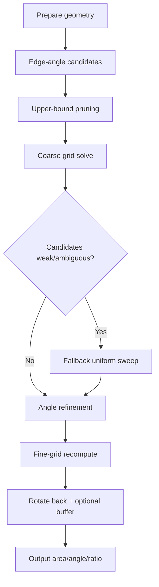

1. Prepare geometry and keep the largest polygon component for multipolygons.
2. Generate orientation candidates from boundary edge directions.
3. Compute a cheap area upper bound per angle and skip weak candidates early.
4. Run coarse grid search on rotated geometry to get the current best rectangle.
5. If candidates are weak or ambiguous, run fallback uniform sweep by `ANGLE_STEP`.
6. Refine around the current best angle with bounded scalar optimization.
7. Recompute at fine grid resolution and rotate rectangle back to map orientation.
8. Apply optional containment buffer and export area/angle/ratio.
9. **Semantics**: approximate area search; not a strict contained solver.

### Approximation Fast

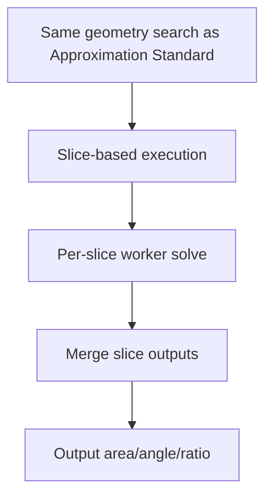

1. Uses the same geometric search logic as Approximation Standard.
2. Executes work as index slices (`process_slice`) to reduce per-feature overhead.
3. Preserves identical output fields while improving throughput on larger batches.
4. **Semantics**: identical to Approximation Standard.

### Contained Standard

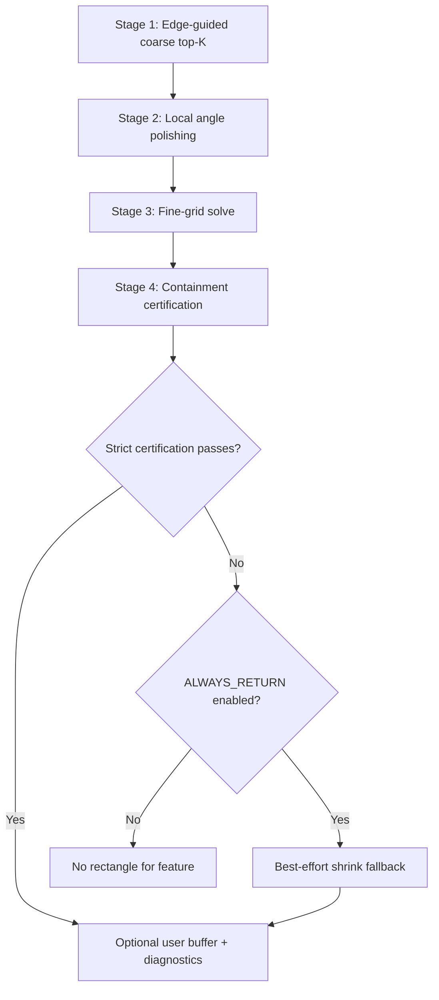

1. Stage 1: edge-guided coarse search produces top-K candidate angles.
2. Stage 2: local angle polishing around each candidate.
3. Stage 3: fine-grid solve at polished and original angles.
4. Stage 4: explicit containment certification with symmetric shrink if required.
5. If strict certification fails and `ALWAYS_RETURN` is enabled, apply best-effort shrink fallback.
6. Optionally apply user buffer and export diagnostics (`cand_rank`, `s2_gain`, `best_effort`).
7. **Semantics**: strict containment-certified solver (unless fallback is used), but without post-certification expansion.

### Contained Fast

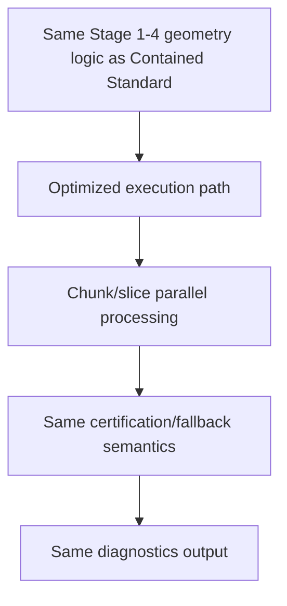

1. Uses the same Stage 1-4 contained workflow as Contained Standard.
2. Uses optimized execution and chunk/slice processing to scale over many features.
3. Keeps containment guarantees and diagnostics behavior aligned with Standard.
4. **Semantics**: identical to Contained Standard.

### BCRS

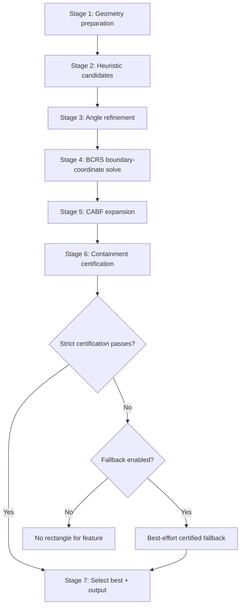

1. **Stage 1 (geometry preparation)**: validate geometry, normalize multipart inputs, optional precision snapping.
2. **Stage 2 (heuristic candidates)**:
   - edge-orientation histogram proposes angles,
   - convex-hull upper bound prunes weak directions,
   - coarse grid search keeps top-K candidates.
3. **Stage 3 (angle refinement)**: bounded Brent optimization around each Stage 2 angle.
4. **Stage 4 (Boundary-Coordinate Raster Solve, BCRS)**:
   - rotate polygon to test angle,
   - create boundary-coordinate grid from polygon vertex x/y values,
   - run variable-pitch histogram solver to get best axis-aligned rectangle at that angle.
5. **Stage 5 (Coordinate-Ascent Boundary Fitting, CABF, expansion)**:
   - expand each side by coordinate-ascent binary search,
   - clamp expansion to nearest boundary coordinates to avoid floating-point overreach.
6. **Stage 6 (containment certification)**:
   - verify full containment in original polygon frame,
   - apply controlled shrink when needed,
   - optional best-effort fallback if strict certification fails and fallback is enabled.
7. **Stage 7 (selection and output)**: keep best certified candidate, compute ratio/gain/best-effort metadata, and return rectangle.
8. **Semantics**: this is the only family here that combines contained certification with explicit boundary expansion (CABF), i.e. the full target formulation in this pack.

### BCRS Fast

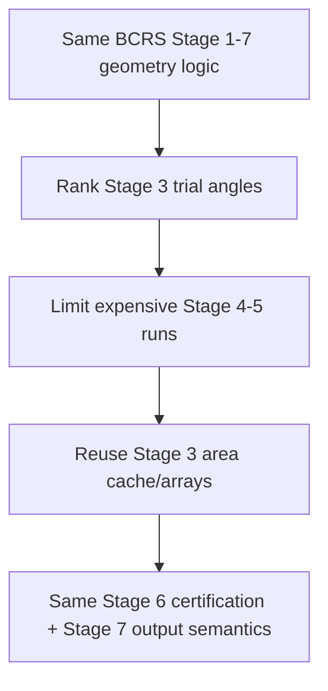

1. Uses the same BCRS Stage 1-7 geometry logic.
2. Adds trial ranking and limits expensive Stage 4-5 runs to strongest nearby angles.
3. Reuses Stage 3 area cache and optimized arrays to reduce repeated computation.
4. Keeps the same containment, fallback, and output semantics as BCRS Standard.
5. **Semantics**: identical to BCRS Standard.

## Folder layout

- `LIRiAP_pack/*_algorithm.py`: QGIS Processing wrappers (parameters, execution, output fields, help text).
- `LIRiAP_pack/*_worker.py`: geometry solvers independent from QGIS/Qt runtime.
- `LIRiAP_pack/numba_bootstrap.py`: optional Numba bootstrap helper.
- `LIRiAP_pack/help_descriptions.py`: shared right-panel algorithm descriptions.
- `tests/*.py`: unit tests for bootstrap safety, edge cases, and tuning-constant guardrails.

## Computational complexity (formal analysis)

### Symbols used in all formulas

| Symbol     | Meaning                                                                                 |
| ---------- | --------------------------------------------------------------------------------------- |
| `n`        | Total polygon vertices (exterior + holes).                                              |
| `g_coarse` | Coarse grid size (`GRID_COARSE`).                                                       |
| `g_fine`   | Fine grid size (`GRID_FINE`).                                                           |
| `k`        | Candidate count kept for refinement (`TOP_K`).                                          |
| `m`        | Edge-guided initial angle candidates (<= 12 in contained/BCRS, <= 10 in approximation). |
| `s90`      | Fallback sweep size:`ceil(90 / a)`, where `a = ANGLE_STEP`.                             |
| `s180`     | Approximation fallback sweep size:`ceil(180 / a)`, where `a = ANGLE_STEP`.              |
| `p`        | Brent objective evaluations (`maxiter=60` where explicitly set).                        |
| `t`        | Stage 4-5 angle trials per candidate (<= 4 in BCRS, <= 2 in BCRS Fast).                 |
| `X, Y`     | Unique boundary x/y coordinates after rotation (BCRS grid lines).                       |
| `nu`       | BCRS cell count: `(                                                                     |

### Primitive solver costs (from implementation loops)

**Uniform grid solver** (`_solve_axis_rect_grid` / `_solve_axis_rect`)

$$
T_{grid}(g) = \Theta(g^2), \quad M_{grid}(g) = \Theta(g^2)
$$

**BCRS variable-pitch solver** (`_solve_axis_rect_bcrs`)

$$
T_{bcrs} = \Theta(n\log n + \nu), \quad M_{bcrs} = \Theta(n+\nu)
$$

Implementation guard: if $\lvert X\rvert > 300$ or $\lvert Y\rvert > 300$, BCRS is skipped (seed fallback).

**CABF expansion** (`_expand_rect_to_boundary`) — bounded iteration counts; worst-case geometric predicate cost model:

$$
T_{cabf} = \Theta(n)
$$

**Certification + best-effort shrink** (`_certify_and_adjust`, `_best_effort_shrink_to_cover`)

$$
T_{cert} = \Theta(n), \quad T_{shrink} = \Theta(n)
$$

### Per-feature worst-case complexity by algorithm

Pipeline composition (generic):

$$
T_{\text{feature}} = T_{\text{angles}} + T_{\text{stage1}} + T_{\text{refine}} + T_{\text{cert/fallback}}
$$

For BCRS-family algorithms, the explicit expansion stage is:

$$
T_{\text{feature,BCRS}} = T_{\text{angles}} + T_{\text{stage1}} + T_{\text{refine}} + T_{\text{expand}} + T_{\text{cert/fallback}}
$$

| Algorithm              | Worst-case time (single feature)                                                                                 | Memory                                        |
| ---------------------- | ---------------------------------------------------------------------------------------------------------------- | --------------------------------------------- |
| Approximation Standard | $O\left(n + (m+s_{180})g_{coarse}^2 + (p+1)g_{fine}^2\right)$ (single refined candidate)                         | $O\left(\max(g_{coarse}^2,g_{fine}^2)\right)$ |
| Approximation Fast     | same geometric order as Approximation Standard (batch/slice execution changes constants)                         | same                                          |
| Contained Standard     | $O\left(n + (m+s_{90})g_{coarse}^2 + k\left((p+2)g_{fine}^2 + n\right)\right)$                                   | $O\left(\max(g_{coarse}^2,g_{fine}^2)\right)$ |
| Contained Fast         | $O\left(n + (m+s_{90})g_{coarse}^2 + k\left(pg_{coarse}^2 + g_{fine}^2 + n\right)\right)$                        | $O\left(\max(g_{coarse}^2,g_{fine}^2)\right)$ |
| BCRS                   | $O\left(n + (m+s_{90})g_{coarse}^2 + k\left(pg_{coarse}^2 + t(g_{fine}^2 + n\log n + \nu + n) + n\right)\right)$ | $O\left(\max(g_{fine}^2,\nu)\right)$          |
| BCRS Fast              | $O\left(n + (m+s_{90})g_{coarse}^2 + k\left((p+4)g_{coarse}^2 + t(n\log n + \nu + n) + n\right)\right),\ t\le2$  | $O\left(\max(g_{coarse}^2,\nu)\right)$        |

### Why Fast variants are faster (math-level deltas)

Contained:

$$
\Delta_{\text{contained}} \approx p\left(g_{fine}^2-g_{coarse}^2\right)\quad\text{(saved per candidate)}
$$

BCRS:

$$
\Delta_{\text{bcrs}} \approx (4-2)\left(n\log n+\nu\right) + 4g_{fine}^2 - 4g_{coarse}^2
$$

### Default-parameter operation model (from algorithm defaults)

Defaults used for this calculation:

- Approximation family: $g_{coarse}=40$, $g_{fine}=100$, single refined candidate ($k=1$ effective), `ANGLE_STEP` $=5$.
- Contained/BCRS families: $g_{coarse}=40$, $g_{fine}=120$, $k=3$, `ANGLE_STEP` $=5$.

Hence $s_{180}=36$, $s_{90}=18$, and $40^2=1600$, $100^2=10000$, $120^2=14400$.

Using $p=60$, $k=1$ effective for Approximation, $k=3$ for Contained/BCRS, $t\le 4$ for BCRS standard (up to 4 trial angles after de-duplication), $m=10$ for Approximation, $m=12$ for Contained/BCRS, and $\nu \le 299\cdot299 = 89401$:

| Algorithm                     | Dominant per-feature term estimate (worst-case style)                                                                  |
| ----------------------------- | ---------------------------------------------------------------------------------------------------------------------- |
| Approximation Standard / Fast | $(10+36)\cdot1600 + (60+1)\cdot10000 = 683600$ grid-units                                                              |
| Contained Standard            | $(12+18)\cdot1600 + 3\cdot(60+2)\cdot14400 = 2726400$ grid-units                                                       |
| Contained Fast                | $(12+18)\cdot1600 + 3\cdot(60\cdot1600 + 14400) = 379200$ grid-units                                                   |
| BCRS                          | $(12+18)\cdot1600 + 3\cdot(60\cdot1600 + 4\cdot(14400 + 89401)) \approx 1581612$ plus certification/CABF geometry cost |
| BCRS Fast                     | $(12+18)\cdot1600 + 3\cdot((60+4)\cdot1600 + 2\cdot89401) \approx 891606$ plus certification/CABF geometry cost        |

Mind that these are complexity-weighted operation counts, not wall-clock predictions.

### Verification test: expected relations vs wall-clock times

Assumptions used for this verification block:

- Approximation Standard/Fast: effective $k=1$, $g_{fine}=100$.
- Contained and BCRS families: $k=3$, $g_{fine}=120$.

Using baseline 5406-feature wall times (`N_WORKERS=1`, no chunking):

| Relation check                 | Model expectation                    | Measured times         | Result     |
| ------------------------------ | ------------------------------------ | ---------------------- | ---------- |
| Approximation Fast vs Standard | nearly equal (same asymptotic order) | $125.93s$ vs $127.25s$ | consistent |
| Contained Fast vs Standard     | Fast should be lower                 | $226.05s < 574.13s$    | consistent |
| BCRS Fast vs BCRS              | Fast should be lower                 | $445.01s < 772.05s$    | consistent |
| Contained Standard vs BCRS     | model estimate favors BCRS           | $574.13s < 772.05s$    | mismatch   |

The model seems to capture intra-family speed relations well; cross-family ordering can remain sensitive to solver semantics, settings, and constant factors not captured by asymptotic terms.
