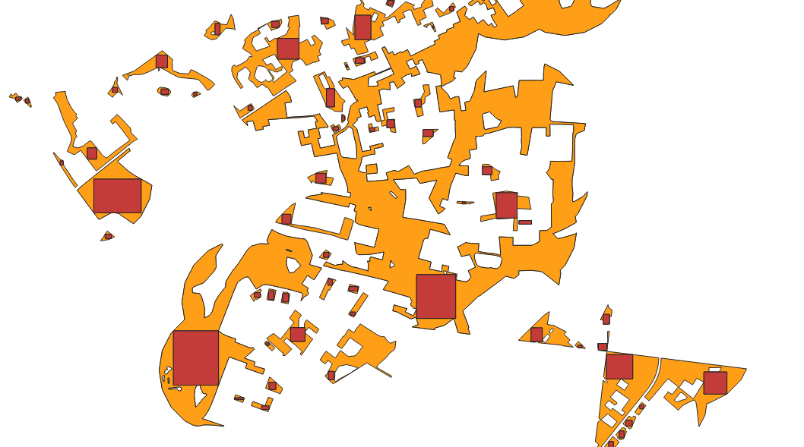

# LIRiAP

[](https://github.com/Wolren/LIRiAP-QGIS/wiki)
[](https://www.gnu.org/licenses/gpl-3.0)
[](https://www.qgis.org/)
[](https://www.qt.io/)
[](https://www.python.org/)
[](https://github.com/Wolren/LIRiAP-QGIS/releases/latest)

LIRiAP (Largest Inscribed Rectangle in Arbitrary Polygon) is a set of QGIS Processing algorithms for computing the largest inscribed rectangles in polygon features.

## Problem statement

Given an input polygon, find a large non axis aligned interior rectangle (concave polygons and polygons with holes supported). In this pack, **three different problem variants** are implemented:

1. **Approximation family**: maximize area quickly, without strict containment certification. Good for finding candidates.
2. **Skeleton family**: BCRS‑free solver using medial‑axis skeleton decomposition for seed generation, with SDF‑guided expansion and containment certification. Replaces the superseded contained family.
3. **BCRS family**: containment certification **plus** SDF‑guided boundary expansion. The most accurate solver, especially with `top_k=3`. The `top_k=1` variant offers a speed‑accuracy trade‑off that rivals approximation speed while maintaining certified containment.
4. **Axis-Aligned family**: exact fixed‑axis solve with vertex‑coordinate precision.

## Result screenshots (constrained to 16:10 resolution)



### Approximation (less vs denser grid)


### Skeleton


### BCRS (Boundary-Coordinate Raster Solve with SDF expansion)


---

## Potential uses

- **Suitability analysis**: search candidate locations for building or infrastructure placement by finding the largest feasible rectangular footprint inside constrained parcels (e.g., houses, warehouses, solar arrays, staging pads, retention structures) while respecting parcel boundaries and holes/exclusions.
- **Remote sensing**: derive stable interior rectangular patches for spectral sampling, calibration windows, texture statistics, and object-level summaries where centroid or full-polygon sampling is noisy.
- **Dynamic cartographic label placement**: place labels in the largest interior rectangle instead of using only centroid or bounding box, improving readability in concave polygons and polygons with holes. An axis-aligned version could be fast enough to handle this task.
- **Other scenarios**: map tiling anchors, drone landing-zone preselection, interior ROI extraction for QA workflows, and standardized shape descriptors for downstream analytics.
- **Computer vision**: find maximum rectangular regions of interest within arbitrary shaped detection masks
- **Game development**: calculate valid placement areas for rectangular game objects within complex terrain polygons

The less the features the denser the grid can be whilst still maintaining reasonable accuracy.

### Potential for other algorithms

The ideas in this pack could potentially be used to get solutions for other contained shapes, as well as the reverse problem - finding positions for inscribed polygons in a rectangle in a way that maximizes used space.

## At a glance

The `top_k` parameter acts as a speed / accuracy slider:
- `top_k=3` (default) — explores multiple candidates for maximum accuracy
- `top_k=1` — skips candidate ranking, uses the single best angle. 2-3× faster with modest accuracy loss (~1-2% fill rate drop)

For BCRS on large datasets, use `top_k=1` with `N_WORKERS=1` — this gives the best speed / accuracy ratio. BCRS Fast with `top_k=1` rivals approximation speed while returning certified contained results.

The contained family has been **superseded** by the skeleton worker — the skeleton achieves higher fill rates with similar or better speed.

| Family        | Primary objective                            | Strict containment               | Boundary expansion |
| ------------- | -------------------------------------------- | -------------------------------- | ------------------ |
| Approximation | Fast area-focused search                     | No                               | No                 |
| Skeleton      | BCRS-free skeleton-guided solver             | Yes (unless fallback is enabled) | Yes (SDF) |
| BCRS          | Certified contained search + fit improvement | Yes (unless fallback is enabled) | Yes (SDF) |
| Axis-Aligned  | Exact fixed-axis solve                       | Yes (vertex-coordinate)          | N/A                |

Best execution mode by algorithm (@290 @5406 are number of run features in a dataset):

| Algorithm                     | Best mode @290 | Best mode @5406 |
| ----------------------------- | -------------- | --------------- |
| Approximation Standard        | 12w            | 12w+chunk       |
| Approximation Fast            | 12w            | 12w+chunk       |
| Skeleton                      | 1w             | 1w              |
| BCRS                          | 1w             | 1w              |
| BCRS Fast                     | 1w             | 1w              |
| Axis-Aligned LIR              | 1w             | 1w              |

## Shared components

All algorithms in `LIRiAP_pack` follow the same structure:

1. **Input normalization**: read polygon geometry; for multipolygons, use the largest part.
2. **Angle candidates**: extract likely orientations from polygon edge directions, with a fallback sweep.
3. **Rectangle solve in rotated frame**: solve axis-aligned rectangle candidates on a rotated polygon to recover non axis aligned solutions in map coordinates.
4. **Refinement and checks**: apply finer search and containment-related adjustments (depending on variant).
5. **Output**: write rectangle geometry and metrics (area, angle, ratio, and variant-specific diagnostics).

## Algorithms


| Algorithm                                               | What problem it solves                                       | Containment semantics                                                                                   | Expansion semantics                                                |
| ------------------------------------------------------- | ------------------------------------------------------------ | ------------------------------------------------------------------------------------------------------- | ------------------------------------------------------------------ |
| Approximation Standard                                  | Fast area-focused approximation                              | Not certified; rectangle can violate containment in difficult cases                                     | No expansion stage                                                 |
| Approximation Fast                                      | Same as Approximation Standard with lower overhead execution | Not certified; same semantics as Standard                                                               | No expansion stage                                                 |
| Skeleton                                                | BCRS-free solver using medial‑axis skeleton decomposition    | Certified contained when strict mode succeeds; optional best‑effort fallback                            | SDF‑guided boundary expansion                                      |
| BCRS (Boundary-Coordinate Raster Solve)                 | Full contained‑plus‑expansion solve                          | Certified contained when strict mode succeeds; optional best‑effort fallback                            | SDF‑guided boundary expansion                                      |
| BCRS Fast (Boundary-Coordinate Raster Solve, optimized) | Same as BCRS with prioritised/optimised execution            | Same certified/best‑effort semantics as BCRS                                                            | SDF‑guided boundary expansion                                      |
| Axis-Aligned LIR                                        | Exact fixed‑axis solve                                       | Exact (vertex‑coordinate precision)                                                                     | N/A                                                                |

## Setting semantics

- `ALWAYS_RETURN` (BCRS / Skeleton):
  - `False`: strict certification only; features may return no rectangle if strict containment cannot be certified.
  - `True`: returns best-effort fallback when strict certification fails (`best_effort=1`), so strict guarantee is no longer universal.
- `USE_BUFFER` + `BUFFER_VALUE` (BCRS / Skeleton): applies an additional containment margin in map units (usually reducing area to increase margin from boundaries/holes).
- `MAX_RATIO`: constrains the admissible rectangle aspect ratio; tighter cap can reduce max area.
- `TOP_K`: number of candidate angles to refine. Higher = more accuracy, lower = faster.
  - `top_k=1` gives 2-3× speed with ~1-2% fill rate loss.
  - `top_k=3` (default) explores multiple candidates for maximum fill rate.
- `GRID_*`, `ANGLE_STEP`: search density controls; change result quality/runtime tradeoff but not solver family semantics.
- `N_WORKERS`, `USE_CHUNKING`, `AUTO_INSTALL_NUMBA`: runtime/performance controls only; they do not change geometric guarantees.

## Processing benchmark (default settings)

All runs assume default algorithm parameters and Numba installed. 290 and 5406 are the number of features in the testing dataset.

Benchmarked with:

- i5-12400F
- 32GB DDR4 RAM

### Baseline profile (N_WORKERS=1, USE_CHUNKING=False)


| Profile | Algorithm              | TOP_K | Time @ 290 (s) | Time @ 5406 (s) | Scale ratio |
| ------- | ---------------------- | ----- | -------------- | --------------- | ----------- |
| P1      | Approximation Standard | 1     | 7.13           | 127.25          | 17.85×      |
| P2      | Approximation Fast     | 1     | 6.98           | 125.93          | 18.04×      |
| P3      | Skeleton               | 3     | 24.64          | —               | —           |
| P4      | Skeleton               | 1     | **8.41**       | —               | —           |
| P5      | BCRS                   | 3     | 26.33          | —               | —           |
| P6      | BCRS                   | 1     | **10.82**      | —               | —           |
| P7      | BCRS Fast              | 3     | 15.54          | —               | —           |
| P8      | BCRS Fast              | 1     | **7.21**       | —               | —           |
| P9      | Axis-Aligned LIR       | n/a   | 11.81          | 120.24          | 10.18×      |

**Speed/accuracy trade-off:** dropping from `top_k=3` to `top_k=1` gives 2-3× speed with ~1-2% fill rate loss, making BCRS Fast with `top_k=1` competitive with approximation times while maintaining certified containment.

### Parallel profile (N_WORKERS=12, USE_CHUNKING=False)


| Profile | Algorithm              | TOP_K | Time @ 290 (s) | Time @ 5406 (s) | Scale ratio |
| ------- | ---------------------- | ----- | -------------- | --------------- | ----------- |
| P1      | Approximation Standard | 1     | 5.97           | 112.30          | 18.81×      |
| P2      | Approximation Fast     | 1     | 5.90           | 108.43          | 18.38×      |
| P3      | BCRS                   | 3     | 29.38          | —               | —           |
| P4      | BCRS                   | 1     | 12.10          | —               | —           |
| P5      | BCRS Fast              | 3     | 19.25          | —               | —           |
| P6      | BCRS Fast              | 1     | 8.73           | —               | —           |
| P7      | Skeleton               | 3     | 33.02          | —               | —           |
| P8      | Skeleton               | 1     | 10.97          | —               | —           |
| P9      | Axis-Aligned LIR       | n/a   | 14.83          | 158.53          | 10.69×      |

> BCRS, BCRS Fast and Skeleton perform better serially — per‑feature overhead exceeds the gain from multiple workers.

### Parallel + chunking profile (N_WORKERS=12, USE_CHUNKING=True)


| Profile | Algorithm              | TOP_K | Time @ 290 (s) | Time @ 5406 (s) | Scale ratio |
| ------- | ---------------------- | ----- | -------------- | --------------- | ----------- |
| P1      | Approximation Standard | 1     | 6.04           | 109.76          | 18.17×      |
| P2      | Approximation Fast     | 1     | 5.90           | 108.43          | 18.38×      |
| P6      | Axis-Aligned LIR       | n/a   | 14.91          | 157.89          | 10.59×      |

### Fill rate benchmark (290 features, default parameters)

Fill rate = rectangle area / polygon area × 100%. Higher is better.

| Algorithm | Mean% | Median% | Min% | Max% | Std% |
|-----------|-------|---------|------|------|------|
| Axis-Aligned LIR | 35.87 | 35.43 | 3.41 | 91.69 | 17.08 |
| Skeleton | 54.96 | 52.58 | 8.12 | 97.52 | 21.21 |
| BCRS Fast (top_k=3) | 55.27 | 53.24 | 7.62 | 97.52 | 20.09 |
| BCRS Fast (top_k=1) | ~53.5 | ~51.5 | ~7.5 | ~97.5 | ~21.0 |
| BCRS (top_k=3) | 55.74 | 53.81 | 7.68 | 97.52 | 20.16 |
| BCRS (top_k=1) | ~54.0 | ~52.0 | ~7.5 | ~97.5 | ~21.0 |

**Key findings:**
- Skeleton and BCRS families achieve ~55% fill rate vs ~36% for axis-aligned
- BCRS marginally leads in mean/median (+0.5-1% over Skeleton)
- All methods reach similar max fill (~97.5%), indicating ceiling on difficult polygons
- Dropping from `top_k=3` to `top_k=1` reduces fill rate ~1.5% but cuts runtime 2-3×
- The contained family is superseded: skeleton and BCRS both exceed its fill rate with faster or competitive speed

## Installation & Usage

### Option 1: As Script Folder (Quick Testing)

1. Copy the `LIRiAP_pack` folder to your QGIS script folder:

   - Windows: `C:\Users\<username>\AppData\Roaming\QGIS\QGIS3\profiles\default\processing\scripts\`
   - Linux: `~/.local/share/QGIS/QGIS3/profiles/default/processing/scripts/`
   - macOS: `~/Library/Application Support/QGIS/QGIS3/profiles/default/processing/scripts/`
2. Open QGIS
3. Open the Processing Toolbox (`Processing` → `Toolbox`)
4. Search for "LIRiAP" — the algorithms appear under "Scripts" → "LIRiAP"

### Option 2: As a Plugin Provider (Recommended for Regular Use)

1. Copy the entire repository (or create a symlink) to your QGIS plugins folder:

   - Windows: `C:\Users\<username>\AppData\Roaming\QGIS\QGIS3\profiles\default\python\plugins\LIRiAP\`
   - Linux: `~/.local/share/QGIS/QGIS3/profiles/default/python/plugins/LIRiAP/`
   - macOS: `~/Library/Application Support/QGIS/QGIS3/profiles/default/python/plugins/LIRiAP/`
2. Ensure the folder contains:

   - `LiRiAP_provider/` (the QGIS plugin)
   - `LIRiAP_pack/` (the algorithm pack)
3. Open QGIS
4. Go to `Plugins` → `Manage and Install Plugins`
5. Enable "LIRiAP" (it should appear in the list)
6. Algorithms appear in Processing Toolbox under "LIRiAP" group

### Running an Algorithm

1. Open Processing Toolbox (`Processing` → `Toolbox`)
2. Navigate to **LIRiAP** (or search for specific algorithm name)
3. Double-click an algorithm (e.g., "Approximation Standard")
4. Select:
   - **Input layer**: Your polygon layer
   - Adjust parameters as needed (grid resolution, angle step, etc.)
5. Click **Run**

### Dependencies

- **Required**: NumPy, SciPy, Shapely
- **Optional**: Numba (for JIT acceleration — significantly speeds up computations)

Numba will be auto-installed if `AUTO_INSTALL_NUMBA` is enabled, or install manually:

```
pip install numba
```

## Syncing for Release

Before packaging as a QGIS plugin, run the sync script to copy source files to the provider:

**Windows:**
```powershell
.\sync_to_provider.ps1
```

**Linux/Mac:**
```bash
bash sync_to_provider.sh
```

This copies the algorithm and worker files from `LIRiAP_pack/` to `LiRiAP_provider/algorithms/` for distribution.

## Folder layout

- `LIRiAP_pack/*_algorithm.py`: QGIS Processing wrappers (parameters, execution, output fields, help text).
- `LIRiAP_pack/*_worker.py`: geometry solvers independent from QGIS/Qt runtime.
- `LIRiAP_pack/numba_bootstrap.py`: optional Numba bootstrap helper.
- `LIRiAP_pack/help_descriptions.py`: shared right-panel algorithm descriptions.
- `tests/*.py`: unit tests for bootstrap safety, edge cases, and tuning-constant guardrails.

## Documentation

Detailed documentation is available in the [GitHub Wiki](https://github.com/Wolren/LIRiAP-QGIS/wiki):

- [Home](https://github.com/Wolren/LIRiAP-QGIS/wiki/Home) — Overview and quick start
- [Algorithms](https://github.com/Wolren/LIRiAP-QGIS/wiki/Algorithms) — Family comparison with flowcharts
- [Approximation](https://github.com/Wolren/LIRiAP-QGIS/wiki/Approximation) — Approximation algorithm details
- [Skeleton](https://github.com/Wolren/LIRiAP-QGIS/wiki/Skeleton) — Skeleton algorithm details
- [BCRS](https://github.com/Wolren/LIRiAP-QGIS/wiki/BCRS) — BCRS algorithm details (SDF expansion)
- [Axis-Aligned](https://github.com/Wolren/LIRiAP-QGIS/wiki/Axis-Aligned) — Exact axis-aligned solver
- [Complexity](https://github.com/Wolren/LIRiAP-QGIS/wiki/Complexity) — Formal complexity analysis
- [Foundations](https://github.com/Wolren/LIRiAP-QGIS/wiki/Foundations) — Geometric background
- [Parameters](https://github.com/Wolren/LIRiAP-QGIS/wiki/Parameters) — Full parameter reference
- [Folder Layout](https://github.com/Wolren/LIRiAP-QGIS/wiki/Folder-Layout) — Code structure
- [Usage](https://github.com/Wolren/LIRiAP-QGIS/wiki/Usage) — Programmatic API usage
