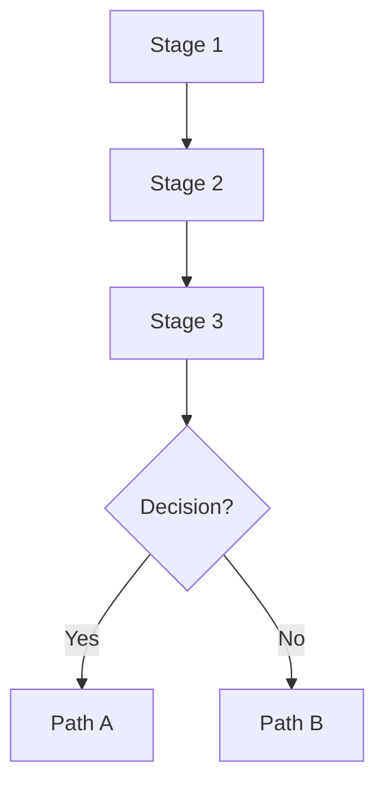

# Algorithm Documentation Template

Use this template when adding new algorithm documentation.

```markdown
# [Algorithm Name]

[One-line description of what this algorithm does.]

## Variants

| Variant | Description | Key Difference |
|---------|-------------|----------------|
| Standard | [Description] | [Difference] |
| Fast | [Description] | [Difference] |

## Algorithm Flow



## Stages

### Stage N: [Name]
[Description of what happens in this stage]

## Semantics

[Explain the algorithm's guarantees and behavior]

## Parameters

| Parameter | Purpose | Default |
|-----------|---------|---------|
| [Param] | [Description] | [Default] |

## Performance

[Performance characteristics, timing, scaling]

## References

- [Reference 1]
- [Reference 2]
```

## Checklist

- [ ] Add flowchart (Mermaid syntax)
- [ ] Document all stages
- [ ] Explain semantics (guarantees, fallbacks)
- [ ] List parameters with defaults
- [ ] Include performance data
- [ ] Add academic references
- [ ] Check cross-references to other docs