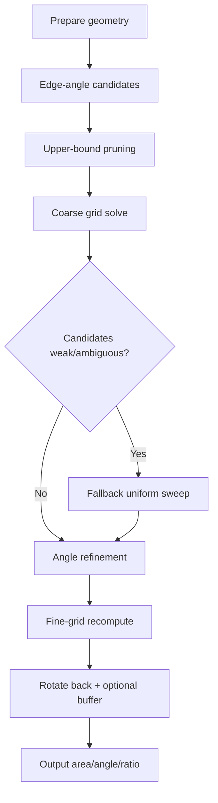

# Approximation Algorithms

The Approximation family provides fast area-focused search without strict containment certification.

## Variants

| Variant | Description | Containment |
|---------|-------------|-------------|
| Standard | Full geometric search | Not certified |
| Fast | Optimized execution | Not certified |

Both variants share identical semantics—Approximation Fast uses slice-based execution for improved throughput.

## Algorithm Flow

## Stages

### 1. Geometry Preparation
- Read polygon geometry
- For multipolygons, use the largest component

### 2. Edge-Angle Candidates
- Extract orientation candidates from polygon edge directions
- Creates set of likely optimal orientations

### 3. Upper-Bound Pruning
- Compute cheap area upper bound per angle
- Skip weak candidates early

### 4. Coarse Grid Solve
- Run grid search on rotated geometry
- Find current best rectangle at coarse resolution

### 5. Fallback Sweep (Conditional)
- If candidates are weak or ambiguous
- Run uniform sweep by ANGLE_STEP across full 180° range

### 6. Angle Refinement
- Bounded scalar optimization around best angle
- Finds local optimum

### 7. Fine-Grid Recompute
- Reconstruct rectangle at fine grid resolution
- Rotate back to map orientation

### 8. Output
- Apply optional containment buffer
- Export area, angle, and ratio

## Semantics

**Approximation algorithms are NOT strict containment solvers.** The rectangle can violate containment in difficult cases. Use these for:
- Quick candidate finding
- Exploratory analysis
- Initial screening before using Contained/BCRS

## Parameters

| Parameter | Effect on Result |
|-----------|-----------------|
| GRID_COARSE | Controls initial search resolution |
| GRID_FINE | Controls refinement resolution |
| ANGLE_STEP | Fallback sweep granularity |
| MAX_RATIO | Aspect ratio constraint |

## Performance

Approximation family is the fastest in LIRiAP:
- Standard: ~7s for 290 features, ~127s for 5406 features
- Fast: ~7s for 290 features, ~126s for 5406 features
- Scales linearly with feature count

Best execution mode: Multithreaded (12 workers) with chunking for large datasets.

## References

Heuristic search patterns based on edge-direction analysis and grid-based sampling.