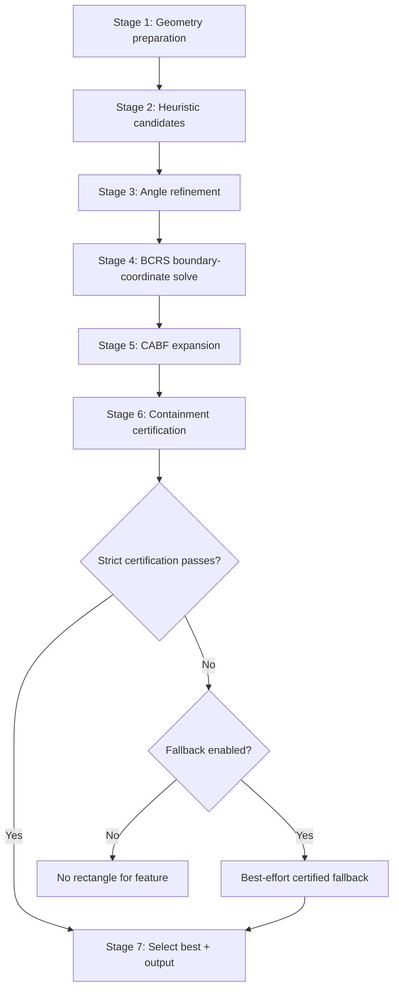

# BCRS Algorithms

BCRS (Boundary-Coordinate Raster Solve) implements the full contained-plus-expansion solve—the only family in LIRiAP that combines containment certification with explicit boundary expansion (CABF).

## Variants

| Variant | Description | Optimization |
|---------|-------------|--------------|
| Standard | Full BCRS workflow | Standard |
| Fast | Prioritized, limited expensive runs | Trial ranking |

## Algorithm Flow

## Novel Contributions

BCRS introduces several novel techniques:

### Boundary-Coordinate Raster Solve (BCRS)
Uses polygon vertex coordinates as grid lines rather than uniform spacing. This creates a variable-pitch histogram solver that adapts to the polygon boundary distribution.

### Coordinate-Ascent Boundary Fitting (CABF)
After initial BCRS solve, expands each side via coordinate-ascent binary search, clamping to nearest boundary coordinates to avoid floating-point overreach.

### Variable-Pitch LRH Kernel
The largest-rectangle-in-histogram solver adapts bin spacing based on boundary coordinate distribution rather than uniform grid.

### Fast Variant Optimizations
- Trial ranking: orders Stage 3 angles by likelihood
- Limited expensive Stage 4-5 runs: only top candidates proceed to boundary-coordinate solve
- Reuses Stage 3 area cache to reduce repeated computation

## Stages

### Stage 1: Geometry Preparation
- Validate geometry
- Normalize multipart inputs (use largest part)
- Optional precision snapping

### Stage 2: Heuristic Candidates
- Edge-orientation histogram proposes angles
- Convex-hull upper bound prunes weak directions
- Coarse grid search keeps top-K candidates

### Stage 3: Angle Refinement
- Bounded Brent optimization around each Stage 2 angle
- Finds local optimum near initial candidate

### Stage 4: BCRS Boundary-Coordinate Solve
- Rotate polygon to test angle
- Create boundary-coordinate grid from vertex x/y values
- Run variable-pitch histogram solver
- Returns best axis-aligned rectangle at that angle

### Stage 5: CABF Expansion
- Expand each side by coordinate-ascent binary search
- Clamp to nearest boundary coordinates
- Avoids floating-point overreach

### Stage 6: Containment Certification
- Verify full containment in original polygon frame
- Apply controlled shrink when needed
- Best-effort fallback if strict fails and fallback enabled

### Stage 7: Selection and Output
- Keep best certified candidate
- Compute ratio/gain/best-effort metadata
- Return rectangle geometry

## Semantics

BCRS is the only algorithm family that combines:
1. Containment certification
2. Explicit boundary expansion (CABF)

This implements the full target formulation in LIRiAP.

## Parameters

| Parameter | Purpose |
|-----------|---------|
| GRID_COARSE | Initial grid resolution |
| GRID_FINE | Fine grid resolution |
| TOP_K | Candidates for refinement |
| ANGLE_STEP | Fallback sweep step |
| MAX_RATIO | Aspect ratio limit |
| ALWAYS_RETURN | Enable best-effort fallback |
| USE_BUFFER | Apply containment buffer |
| BUFFER_VALUE | Buffer distance |

## Performance

| Variant | Time @290 | Time @5406 | Scaling |
|---------|----------|------------|---------|
| Standard (strict) | 42.91s | 772.05s | 17.99x |
| Standard (fallback) | 42.35s | 788.03s | 18.61x |
| Fast (fallback) | 23.61s | 445.01s | 18.85x |

Best execution mode: Single worker (1w) — parallelization overhead exceeds benefit for this algorithm.

## Output Fields

- `area`: Rectangle area in CRS map units
- `angle`: Rotation angle in degrees
- `ratio`: Aspect ratio (long:short)
- `cand_rank`: Rank of selected candidate
- `s2_gain`: Area gain from Stage 2
- `s4_gain`: Area gain from Stage 4 (BCRS)
- `s5_gain`: Area gain from Stage 5 (CABF expansion)
- `best_effort`: 1 if fallback used, 0 otherwise

## References

- Daniels, K., Milenkovic, V., Roth, D. (1997). Finding the largest axis-aligned rectangle in a polygon. Proc. 13th CCCG.
- Bentley, J.L. (1977). Programming Pearls: Fast Algorithms for Polygon Containment.
- Preparata, F.P., Shamos, M.I. (1985). Computational Geometry: An Introduction.