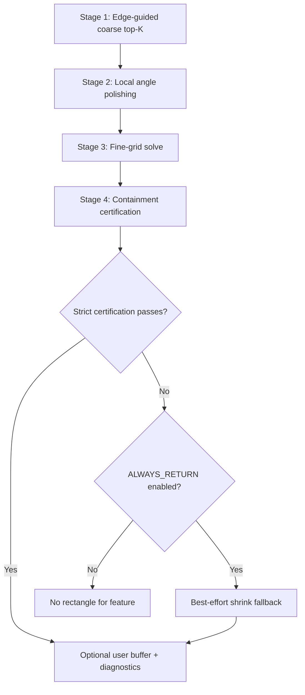

# Contained Algorithms

The Contained family provides certified contained rectangle search with strict containment guarantees (unless fallback is enabled).

## Variants

| Variant | Description | Optimization |
|---------|-------------|--------------|
| Standard | Full geometric search | Standard optimization |
| Fast | Prioritized execution | Reduced expensive runs |

## Algorithm Flow

## Stages

### Stage 1: Edge-Guided Coarse Top-K
- Extract edge orientations from polygon boundary
- Generate initial angle candidates (m <= 12)
- Run coarse grid search at each candidate
- Keep top-K candidates for refinement

### Stage 2: Local Angle Polishing
- Apply bounded Brent optimization around each candidate
- Find local optimum near initial guess

### Stage 3: Fine-Grid Solve
- Compute at refined angles plus originals
- Higher resolution than Stage 1

### Stage 4: Containment Certification
- Verify rectangle is fully contained
- Apply symmetric shrink if needed for certification
- If strict fails and ALWAYS_RETURN enabled, use best-effort fallback

### Stage 5: Output (if certified)
- Apply optional user buffer
- Export diagnostics: cand_rank, s2_gain, best_effort

## Semantics

**Contained algorithms enforce strict containment** when strict mode succeeds. Key behaviors:

| Mode | ALWAYS_RETURN | Behavior |
|------|---------------|----------|
| Strict | False | Only return if certification passes |
| Fallback | True | Return best-effort if certification fails |

When using fallback, the strict guarantee is no longer universal.

## Parameters

| Parameter | Purpose |
|-----------|---------|
| GRID_COARSE | Initial grid resolution |
| GRID_FINE | Fine grid resolution |
| TOP_K | Candidates for refinement |
| ANGLE_STEP | Fallback sweep step |
| MAX_RATIO | Aspect ratio limit |
| ALWAYS_RETURN | Enable best-effort fallback |
| USE_BUFFER | Apply containment buffer |
| BUFFER_VALUE | Buffer distance |

## Performance

| Variant | Time @290 | Time @5406 | Scaling |
|---------|----------|------------|---------|
| Standard (strict) | 30.45s | 574.13s | 18.85x |
| Standard (fallback) | 30.75s | 573.59s | 18.65x |
| Fast (fallback) | 12.25s | 226.05s | 18.45x |

Best execution mode: 12 workers with chunking for most datasets.

## Output Fields

- `area`: Rectangle area in CRS map units
- `angle`: Rotation angle in degrees
- `ratio`: Aspect ratio (long:short)
- `cand_rank`: Rank of selected candidate (0 = best)
- `s2_gain`: Area gain from Stage 2 polishing
- `best_effort`: 1 if fallback used, 0 otherwise

## References

- Brent, R.P. (1973). Algorithms for Finding Zeros and Extrema of Functions Without Calculating Derivatives
- Goldstein, L., et al. optimization techniques for contained search